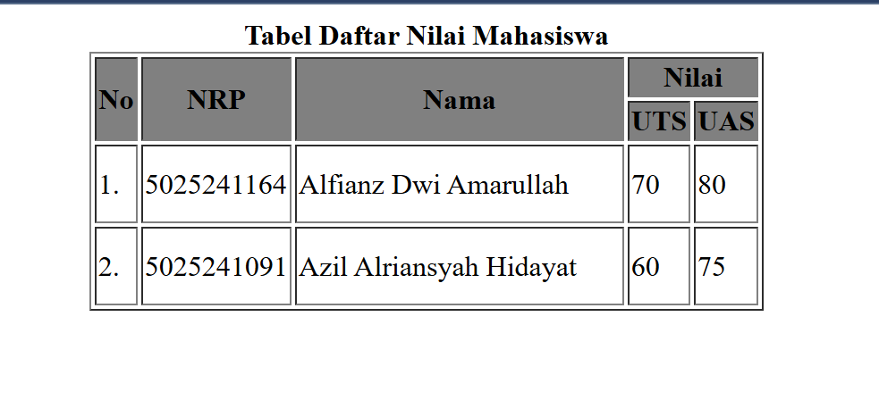
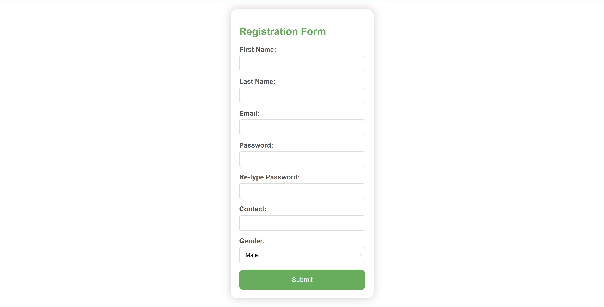
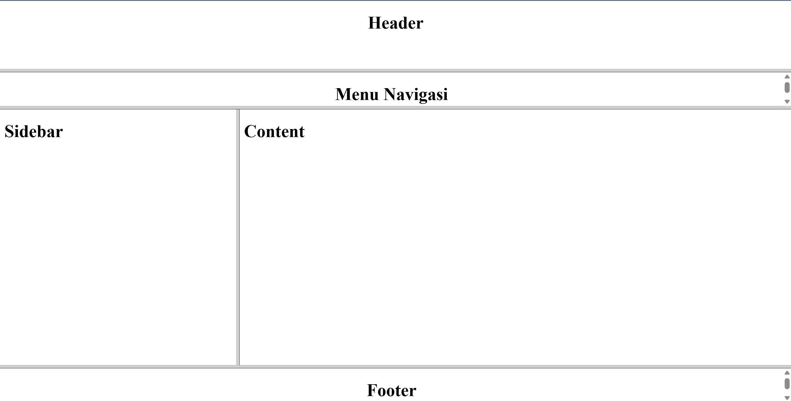

# Dokumentasi Pertemuan 3

Hari ini saya belajar materi HTML lanjutan yaitu tabel, form dan frame. Berikut adalah dokumentasi dari materi yang telah saya pelajari.

## Tabel
### Source code
    untuk file source code ada di Tabel.html
### penjelasan
- `<table>` : Digunakan untuk membuat tabel di halaman web.
- `<tr>` : Digunakan untuk mendefinisikan baris dalam tabel.
- `<th>` : Digunakan untuk mendefinisikan sel header dalam tabel.
- `<td>` : Digunakan untuk mendefinisikan sel data dalam tabel.
- `colspan` : Atribut pada elemen `<th>` atau `<td>` yang menentukan berapa banyak kolom yang akan digabungkan.
- `rowspan` : Atribut pada elemen `<th>` atau `<td>` yang menentukan berapa banyak baris yang akan digabungkan.
- `border` : Atribut pada elemen `<table>` yang menentukan lebar border tabel.
### Gambar

## Form
### Source code
    untuk file source code ada di Form.html
### penjelasan
- `<form>` : Digunakan untuk membuat formulir di halaman web.
- `<label>` : Digunakan untuk memberikan label pada elemen form.
- `<input>` : Digunakan untuk membuat berbagai jenis input seperti teks, tombol radio, checkbox, dll.
- `<textarea>` : Digunakan untuk membuat area teks yang dapat diisi oleh pengguna.
- `<select>` : Digunakan untuk membuat dropdown list.
- `<option>` : Digunakan untuk mendefinisikan opsi dalam elemen `<select>`.
- `type` : Atribut pada elemen `<input>` yang menentukan jenis input (misalnya "text", "radio", "checkbox", dll).
- `name` : Atribut pada elemen form yang memberikan nama pada elemen tersebut, yang digunakan saat mengirim data form.
### Gambar

## Frame
### Source code
    untuk file source code ada di Frame.html
### penjelasan
- `<frameset>` : Digunakan untuk mendefinisikan kumpulan frame dalam halaman web.
- `<frame>` : Digunakan untuk mendefinisikan setiap frame dalam frameset.
- `rows` dan `cols` : Atribut pada `<frameset>` yang menentukan pembagian baris dan kolom pada halaman.
- `src` : Atribut pada `<frame>` yang menentukan sumber konten yang akan ditampilkan dalam frame tersebut.
### Gambar

