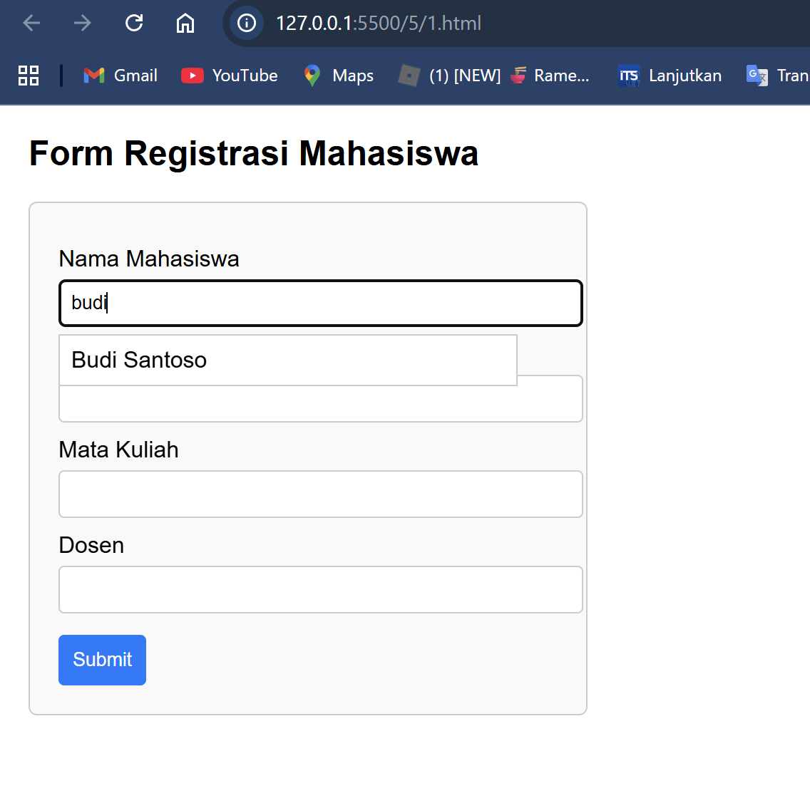
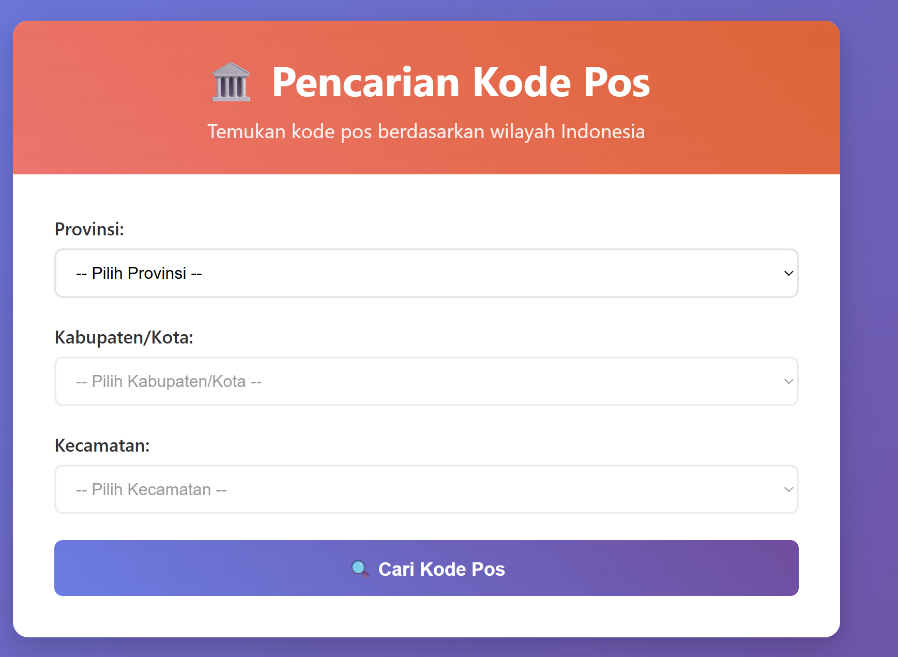
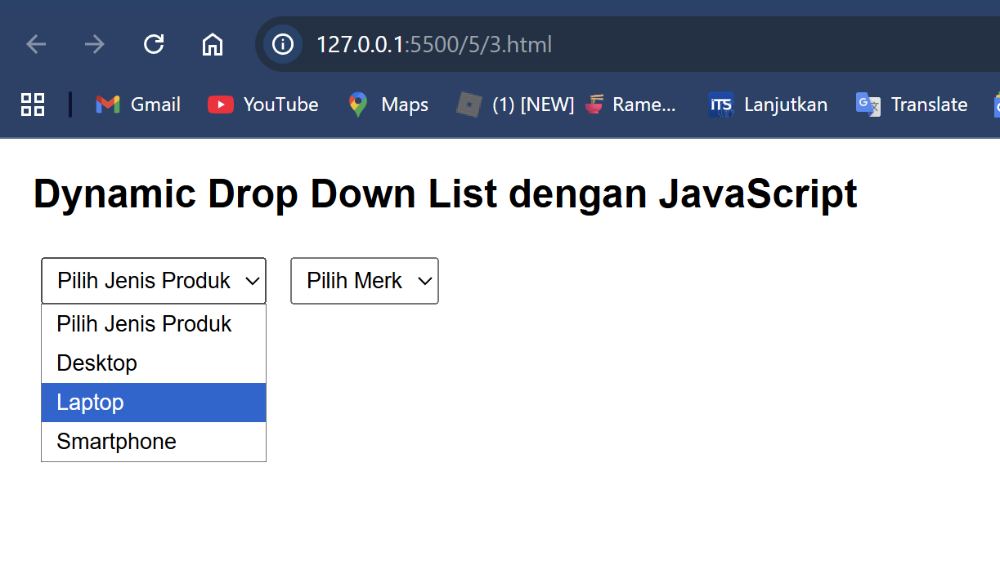

# 📚 Dokumentasi Project JavaScript

Repositori ini berisi 3 file HTML dengan implementasi JavaScript untuk berbagai keperluan web development. Berikut adalah dokumentasi lengkap untuk setiap file.

---

## 📁 File Overview

| No | Nama File | Deskripsi | Fitur Utama |
|----|-----------|-----------|-------------|
| 1 | `1.html` | Form Registrasi Mahasiswa | Autocomplete, Validasi Form |
| 2 | `2.html` | Pencarian Kode Pos Indonesia | Dynamic Dropdown, API JSON |
| 3 | `3.html` | Dropdown Dinamis Produk | Cascading Dropdown |

---

## 🎓 1. Form Registrasi Mahasiswa (`1.html`)

### **Deskripsi**
Form registrasi untuk mahasiswa dengan fitur autocomplete pada input nama dan validasi form yang lengkap.

### **Fitur Utama**
- ✅ **Autocomplete Nama**: Suggestions nama mahasiswa saat mengetik
- ✅ **Form Validation**: Validasi semua field wajib
- ✅ **Responsive Design**: Tampilan yang responsif
- ✅ **Interactive UI**: Hover effects dan styling modern

### **Struktur Form**
```
├── Nama Mahasiswa (dengan autocomplete)
├── NRP (Nomor Registrasi Pokok)
├── Mata Kuliah
├── Dosen
└── Submit Button
```

### **Data Autocomplete**
```javascript
const namaList = [
    "Nur Akbar", 
    "Ahmad Fauzi", 
    "Budi Santoso", 
    "Citra Lestari", 
    "Dewi Ayu", 
    "Eka Saputra"
];
```

### **Fungsi JavaScript Utama**
- `addEventListener("input")` - Handle autocomplete
- `addEventListener("submit")` - Form validation
- Dynamic suggestions filtering

### **Cara Penggunaan**
1. Buka file `1.html` di browser
2. Ketik nama di field "Nama Mahasiswa" untuk melihat suggestions
3. Isi semua field yang required
4. Klik Submit untuk validasi

---

## 🏛️ 2. Pencarian Kode Pos Indonesia (`2.html`)

### **Deskripsi**
Aplikasi web untuk mencari kode pos Indonesia berdasarkan Provinsi, Kabupaten/Kota, dan Kecamatan dengan data dari file JSON.

### **Fitur Utama**
- 🗺️ **3-Level Filtering**: Provinsi → Kabupaten → Kecamatan
- 📊 **Dynamic Dropdown**: Pilihan berubah berdasarkan seleksi
- 🔍 **Real-time Search**: Loading indicator dan animasi
- 📱 **Responsive Design**: Mobile-friendly interface
- 📋 **Multiple Results**: Menampilkan semua hasil yang cocok

### **Struktur Data JSON**
```json
{
    "provinsi": "DKI Jakarta",
    "kabupaten": "Jakarta Pusat", 
    "kecamatan": "Menteng",
    "kelurahan": "Menteng",
    "kodepos": "10310"
}
```

### **Fungsi JavaScript Utama**
- `loadPostalData()` - Load data dari JSON file
- `populateProvinces()` - Isi dropdown provinsi
- `populateKabupaten()` - Isi dropdown kabupaten
- `populateKecamatan()` - Isi dropdown kecamatan
- `searchPostalCode()` - Proses pencarian
- `displayResults()` - Tampilkan hasil

### **File Terkait**
- `kodepos.json` - Database kode pos Indonesia
- CSS internal dengan gradient design

### **Cara Penggunaan**
1. Buka file `2.html` di browser
2. Pilih Provinsi dari dropdown pertama
3. Pilih Kabupaten/Kota dari dropdown kedua  
4. Pilih Kecamatan dari dropdown ketiga
5. Klik "Cari Kode Pos" untuk mendapatkan hasil

---

## 🛒 3. Dropdown Dinamis Produk (`3.html`)

### **Deskripsi**
Implementasi dropdown cascading untuk pemilihan kategori produk dan merk yang terkait.

### **Fitur Utama**
- 🔄 **Cascading Dropdown**: Dropdown kedua berubah berdasarkan pilihan pertama
- 🛍️ **Kategori Produk**: Desktop, Laptop, Smartphone
- 🏷️ **Dynamic Options**: Merk berubah sesuai kategori
- ⚡ **Lightweight**: Code yang simpel dan efisien

### **Mapping Kategori-Merk**
```
Desktop:
├── Acer
├── Dell
└── Lenovo

Laptop:
├── Asus
├── Acer
└── Sony Vaio

Smartphone:
├── Samsung
├── LG
└── Sony Xperia
```

### **Fungsi JavaScript Utama**
- `SelectCat2()` - Handle perubahan kategori
- `removeAllOptions()` - Clear dropdown options
- `addOption()` - Add new option ke dropdown

### **Cara Penggunaan**
1. Buka file `3.html` di browser
2. Pilih jenis produk dari dropdown pertama
3. Dropdown kedua akan otomatis terisi dengan merk yang sesuai

---

## 🔧 Struktur File

```
📁 WEB PROGRAMMING/5/
├── 📄 1.html                 # Form Registrasi Mahasiswa
├── 📄 2.html                 # Pencarian Kode Pos  
├── 📄 3.html                 # Dropdown Dinamis
├── 📄 kodepos.json           # Database Kode Pos
├── 📄 pencarian-kodepos.html # File alternatif kode pos
└── 📄 README.md              # Dokumentasi ini
```

---

## 👨‍💻 Author & Credits

**Developer**: Muhammad Adi Anugerah Arrahman
**Date**: September 2025
**Version**: 1.0

### **Technologies Used**
- HTML5
- CSS3 (Flexbox, Grid, Animations)
- Vanilla JavaScript (ES6+)
- JSON for data storage

---

## 📄 License

This project is for educational purposes. Feel free to use and modify for learning.

---





*💡 **Note**: Semua file telah ditest dan berfungsi dengan baik. Untuk pertanyaan atau issues, silakan buat issue di repositori ini.*
