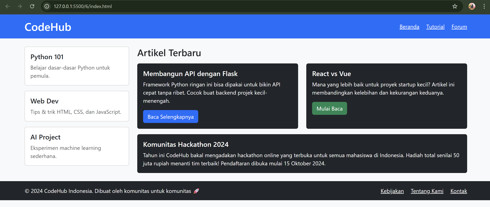
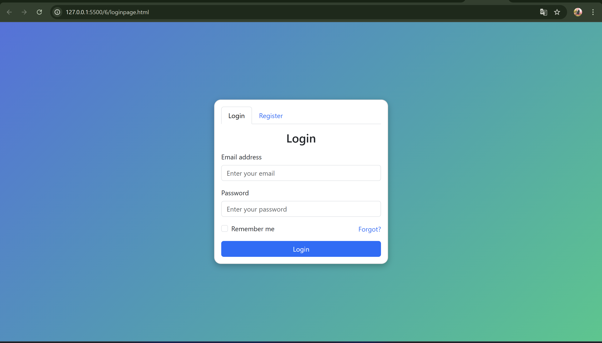

# Dokumentasi Project Web Programming

## Overview
Project ini terdiri dari 2 halaman web yang dibuat menggunakan Bootstrap 5.3.3 untuk framework CSS. Project ini menampilkan implementasi responsive design dan komponen UI modern.

## Halaman 1: index.html - CodeHub Homepage

### Deskripsi
Halaman utama website CodeHub yang menampilkan platform pembelajaran programming dengan layout yang responsif.

### Fitur Utama
- **Header Navigation**: Logo CodeHub dengan menu navigasi (Beranda, Tutorial, Forum)
- **Sidebar**: Menampilkan kategori pembelajaran (Python 101, Web Dev, AI Project)
- **Content Area**: 
  - Artikel terbaru dalam format card
  - Featured content tentang hackathon komunitas
- **Footer**: Informasi copyright dan link tambahan

### Teknologi
- Bootstrap 5.3.3 (CSS Framework)
- Responsive grid system (col-md-3, col-md-9, col-md-6)
- Bootstrap components: navbar, cards, buttons

### Color Scheme
- Primary: Blue (#007bff)
- Background: Light gray
- Cards: Dark theme dengan white text
- Success buttons: Green

## Halaman 2: loginpage.html - Authentication Page

### Deskripsi
Halaman autentikasi dengan dual-tab interface untuk login dan registrasi pengguna.

### Fitur Utama
- **Tab Navigation**: Switch antara Login dan Register
- **Login Form**:
  - Email input field
  - Password input field
  - Remember me checkbox
  - Forgot password link
- **Register Form**:
  - Full name input
  - Email input
  - Password input
  - Confirm password input

### Teknologi
- Bootstrap 5.3.3 tabs component
- Form validation (required attributes)
- Gradient background design
- Custom CSS styling

### Design Features
- Centered layout dengan flexbox
- Gradient background (blue to green)
- Card-based form design
- Rounded corners dan shadow effects
- Responsive design (width: 26rem)

## Komponen Bootstrap yang Digunakan

### index.html
- Container & Grid System
- Navigation
- Cards
- Buttons (btn-primary, btn-success)
- Responsive utilities

### loginpage.html
- Nav tabs
- Forms & Form controls
- Buttons
- Cards
- Custom CSS untuk styling
