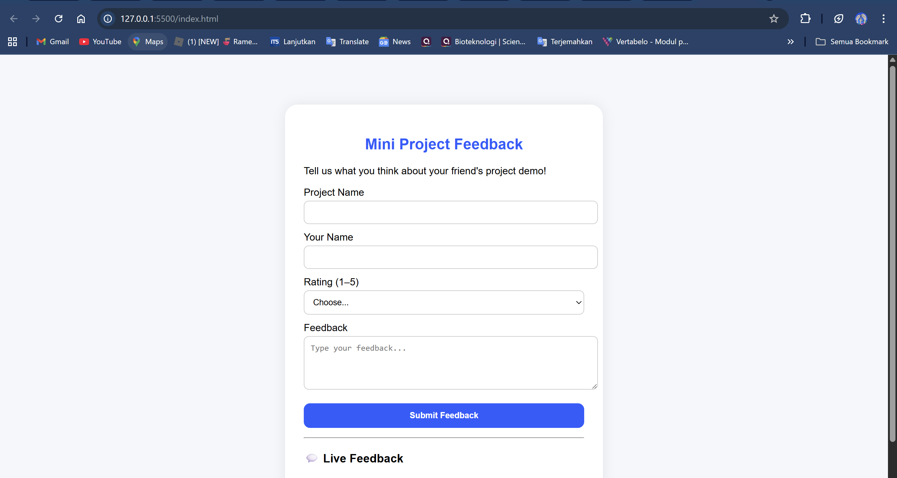

# LAPORAN DOKUMENTASI
## Submit Form Without Page Refresh dengan AJAX

---

### Identitas Mahasiswa
- **Nama**: Muhammad Adi Anugerah Arrahman
- **NRP**: 5025241118
- **Mata Kuliah**: Pemrograman Web
- **Topik**: AJAX (Asynchronous JavaScript and XML)

---

## 1. PENDAHULUAN

### 1.1 Latar Belakang
Dalam pengembangan aplikasi web modern, user experience (UX) menjadi faktor yang sangat penting. Salah satu cara untuk meningkatkan UX adalah dengan menghindari refresh halaman yang tidak perlu saat mengirim data form. Teknologi AJAX memungkinkan pengiriman data secara asynchronous tanpa perlu me-refresh seluruh halaman web.

### 1.2 Tujuan
Proyek ini bertujuan untuk:
- Mengimplementasikan pengiriman form tanpa refresh halaman menggunakan AJAX
- Menampilkan feedback secara real-time
- Memberikan response yang responsif kepada pengguna
- Mempelajari integrasi antara JavaScript (jQuery), PHP, dan file handling

### 1.3 Ruang Lingkup
Aplikasi ini mencakup:
- Form feedback untuk mini project
- Sistem penyimpanan data menggunakan file text
- Tampilan feedback real-time
- Interface yang user-friendly

---

## 2. ANALISIS SISTEM

### 2.1 Arsitektur Aplikasi
```
Frontend (Client-side)
├── HTML (Structure)
├── CSS (Styling)
└── JavaScript/jQuery (AJAX Logic)

Backend (Server-side)
├── PHP (Data Processing)
└── Text File (Data Storage)
```

### 2.2 Komponen Utama
1. **Frontend Components**:
   - `index.html` - Struktur halaman utama
   - `style.css` - Styling dan layout
   - `script.js` - Logic AJAX dan interaksi

2. **Backend Components**:
   - `submit.php` - Handler untuk menyimpan feedback
   - `fetch_feedback.php` - Handler untuk mengambil data feedback
   - `feedback.txt` - File penyimpanan data

---

## 3. IMPLEMENTASI

### 3.1 Structure HTML (`index.html`)

File HTML menyediakan struktur dasar aplikasi dengan komponen-komponen berikut:

#### Form Elements:
- **Project Name**: Input text untuk nama project
- **Reviewer**: Input text untuk nama reviewer
- **Rating**: Dropdown selection (1-5)
- **Comments**: Textarea untuk feedback detail

#### Display Elements:
- **Response Message**: Area untuk menampilkan status submission
- **Feedback List**: Area untuk menampilkan daftar feedback secara real-time

```html
<form id="feedbackForm">
  <label for="projectName">Project Name</label>
  <input type="text" id="projectName" name="projectName" required>
  
  <label for="reviewer">Your Name</label>
  <input type="text" id="reviewer" name="reviewer" required>
  
  <label for="rating">Rating (1–5)</label>
  <select id="rating" name="rating" required>
    <option value="">Choose...</option>
    <option>1</option>
    <option>2</option>
    <option>3</option>
    <option>4</option>
    <option>5</option>
  </select>
  
  <label for="comments">Feedback</label>
  <textarea id="comments" name="comments" rows="4" placeholder="Type your feedback..."></textarea>
  
  <button type="submit">Submit Feedback</button>
</form>
```

### 3.2 Styling CSS (`style.css`)

Implementasi styling menggunakan pendekatan modern dengan fitur:

#### Design Features:
- **Background**: Gradient dengan warna soft (`#f6f7fb`)
- **Container**: Card-based design dengan border-radius dan shadow
- **Typography**: Font Poppins untuk readability
- **Color Scheme**: Primary blue (`#2b5cff`) dengan variations
- **Responsive Elements**: Full-width inputs dengan consistent padding

#### Key Styling Rules:
```css
.container {
  width: 450px;
  margin: 80px auto;
  padding: 30px;
  background: #fff;
  border-radius: 20px;
  box-shadow: 0 0 20px rgba(0, 0, 0, 0.08);
}

.feedback-card {
  background: #f2f5ff;
  padding: 10px 15px;
  margin-top: 10px;
  border-left: 5px solid #2b5cff;
  border-radius: 8px;
}
```

### 3.3 JavaScript Logic (`script.js`)

Implementasi AJAX menggunakan jQuery dengan tiga fungsi utama:

#### 3.3.1 Form Submission Handler
```javascript
$("#feedbackForm").on("submit", function (e) {
  e.preventDefault();  // Mencegah form submit default
  
  $.ajax({
    url: "submit.php",
    type: "POST",
    data: $(this).serialize(),
    success: function (response) {
      $("#responseMessage").html(`<span style="color:green;">${response}</span>`);
      $("#feedbackForm")[0].reset();
      fetchFeedback(); // Refresh feedback list
    },
    error: function () {
      $("#responseMessage").html(`<span style="color:red;">Something went wrong. Try again!</span>`);
    }
  });
});
```

#### 3.3.2 Fetch Feedback Function
```javascript
function fetchFeedback() {
  $.ajax({
    url: "fetch_feedback.php",
    method: "GET",
    success: function (data) {
      $("#feedbackList").html(data);
    },
    error: function () {
      $("#feedbackList").html("<i>Could not load feedbacks.</i>");
    }
  });
}
```

#### 3.3.3 Document Ready Handler
```javascript
$(document).ready(function () {
  fetchFeedback(); // Load existing feedback on page load
  // Form submission handler
  // ... (implementation above)
});
```

### 3.4 Backend Processing

#### 3.4.1 Submit Handler (`submit.php`)
```php
<?php
if ($_SERVER["REQUEST_METHOD"] == "POST") {
  $projectName = $_POST['projectName'];
  $reviewer = $_POST['reviewer'];
  $rating = $_POST['rating'];
  $comments = $_POST['comments'];

  $data = "$projectName|$reviewer|$rating|$comments\n";
  file_put_contents("feedback.txt", $data, FILE_APPEND);

  echo "Thanks $reviewer! Your feedback for '$projectName' has been saved 💙";
} else {
  echo "Invalid request";
}
?>
```

#### 3.4.2 Fetch Handler (`fetch_feedback.php`)
```php
<?php
$file = "feedback.txt";
if (file_exists($file)) {
  $lines = file($file, FILE_IGNORE_NEW_LINES | FILE_SKIP_EMPTY_LINES);
  $lines = array_reverse($lines); // Show newest first

  foreach ($lines as $line) {
    list($project, $reviewer, $rating, $comment) = explode("|", $line);
    echo "<div class='feedback-card'>
            <b>$project</b> — Rated <b>$rating/5</b><br>
            \"$comment\"<br>
            <small>by <i>$reviewer</i></small>
          </div>";
  }
} else {
  echo "<i>No feedback yet. Be the first!</i>";
}
?>
```

---

## 4. FLOW APLIKASI

### 4.1 User Journey
```
1. User membuka halaman aplikasi
2. Sistem memuat feedback yang sudah ada (fetchFeedback())
3. User mengisi form feedback
4. User menekan tombol Submit
5. JavaScript mencegah form submit default
6. AJAX mengirim data ke submit.php
7. PHP memproses dan menyimpan data ke feedback.txt
8. PHP mengembalikan response success
9. JavaScript menampilkan message success
10. Form di-reset secara otomatis
11. Daftar feedback di-refresh untuk menampilkan data terbaru
```

### 4.2 Data Flow Diagram
```
Frontend                Backend               Storage
   |                       |                     |
   |---> AJAX POST ------->|                     |
   |     (form data)       |---> Write Data ---->|
   |                       |     (feedback.txt)  |
   |<--- Response ---------|                     |
   |     (success msg)     |                     |
   |                       |                     |
   |---> AJAX GET -------->|                     |
   |     (fetch request)   |<--- Read Data ------|
   |<--- HTML Response ----|     (feedback.txt)  |
   |     (feedback list)   |                     |
```

---

## 5. FITUR UTAMA

### 5.1 Asynchronous Form Submission
- **Deskripsi**: Form dapat dikirim tanpa refresh halaman
- **Teknologi**: jQuery AJAX dengan method POST
- **Benefit**: Improved user experience, faster response time

### 5.2 Real-time Feedback Display
- **Deskripsi**: Feedback list ter-update otomatis setelah submission
- **Teknologi**: AJAX GET request untuk fetch data terbaru
- **Benefit**: User dapat melihat feedback mereka langsung tanpa reload

### 5.3 Input Validation
- **Client-side**: HTML5 required attributes
- **Server-side**: PHP POST method validation
- **Fields**: Semua field form bersifat required kecuali comments

### 5.4 Error Handling
- **AJAX Error**: Menampilkan error message jika request gagal
- **PHP Validation**: Validasi POST request method
- **File Handling**: Check file existence sebelum read

### 5.5 Data Persistence
- **Storage**: File-based storage menggunakan feedback.txt
- **Format**: Pipe-separated values (|) untuk delimiter
- **Ordering**: Newest first menggunakan array_reverse()

---

## 6. TEKNOLOGI YANG DIGUNAKAN

### 6.1 Frontend Technologies
- **HTML5**: Structure dan semantic markup
- **CSS3**: Styling dengan modern features (flexbox, border-radius, box-shadow)
- **JavaScript (ES6+)**: Client-side logic
- **jQuery 3.6.0**: AJAX implementation dan DOM manipulation

### 6.2 Backend Technologies
- **PHP**: Server-side processing
- **File System**: Text file untuk data storage

### 6.3 Development Tools
- **Text Editor/IDE**: Visual Studio Code (berdasarkan context)
- **Browser**: Modern browser dengan JavaScript support
- **Local Server**: XAMPP/WAMP/LAMP untuk PHP execution

---

## 7. TESTING & DEBUGGING

### 7.1 Test Cases
1. **Form Submission Test**:
   - ✅ Submit dengan semua field terisi
   - ✅ Submit dengan field kosong (validation check)
   - ✅ Submit dengan karakter special

2. **AJAX Functionality Test**:
   - ✅ Success response handling
   - ✅ Error response handling
   - ✅ Network timeout handling

3. **Data Persistence Test**:
   - ✅ Data tersimpan dengan format yang benar
   - ✅ Data ter-display dengan urutan yang benar
   - ✅ File creation jika belum ada

### 7.2 Browser Compatibility
- ✅ Chrome (Latest)
- ✅ Firefox (Latest)
- ✅ Safari (Latest)
- ✅ Edge (Latest)

---

## 8. SCREENSHOT APLIKASI



*Gambar di atas menunjukkan interface aplikasi feedback dengan form submission dan live feedback display.*

---

## 9. KESIMPULAN

Proyek "Submit Form Without Page Refresh dengan AJAX" ini berhasil mengimplementasikan:

1. **Form submission asynchronous** menggunakan jQuery AJAX
2. **Real-time data display** tanpa page refresh
3. **File-based data persistence** dengan PHP
4. **User-friendly interface** dengan responsive design
5. **Error handling** yang proper untuk user experience

Aplikasi ini mendemonstrasikan konsep dasar AJAX dalam pengembangan web modern, di mana user interaction dapat dilakukan secara seamless tanpa mengganggu flow aplikasi dengan page reload.

### Pembelajaran Utama:
- Implementasi AJAX untuk form submission
- Integrasi frontend (JavaScript) dengan backend (PHP)
- File handling untuk data persistence
- Event handling dan DOM manipulation
- Asynchronous programming concepts

Proyek ini memberikan foundation yang solid untuk pengembangan aplikasi web yang lebih kompleks dengan teknologi AJAX dan dapat menjadi stepping stone untuk pembelajaran framework JavaScript modern seperti React, Vue, atau Angular.

---

**Tanggal Pembuatan**: 7 Oktober 2025  
**Dibuat oleh**: Muhammad Adi Anugerah Arrahman (5025241118)