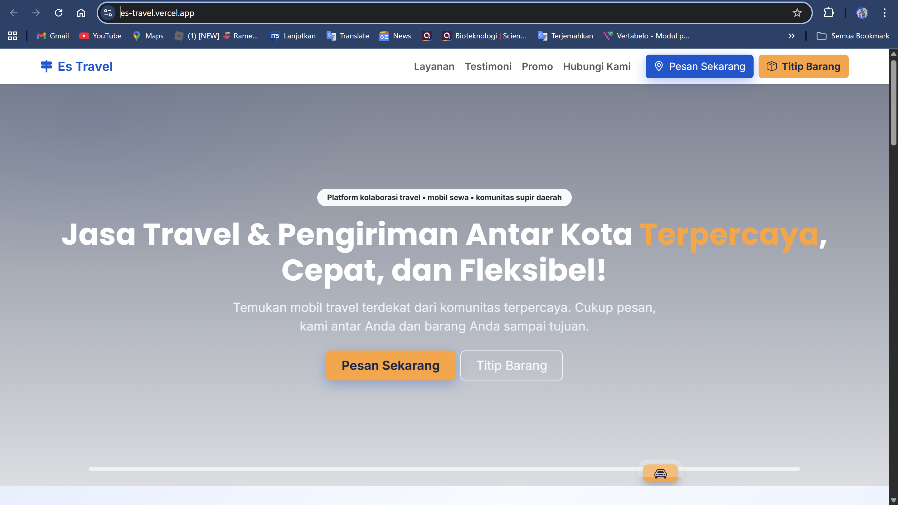
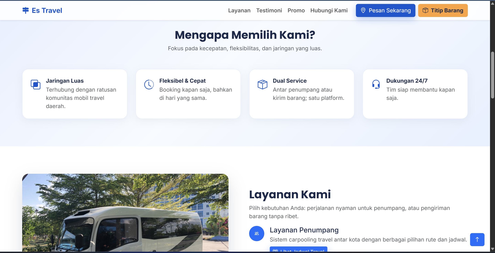
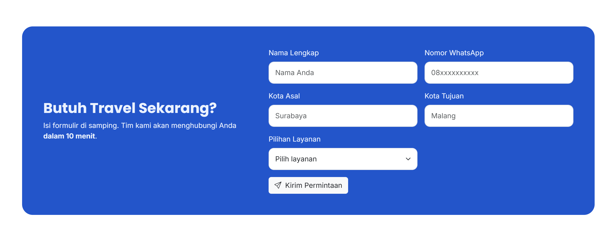
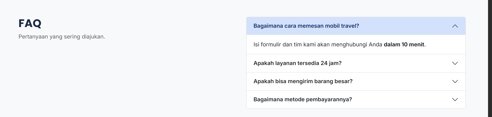

# 🌐 DOKUMENTASI ETS PWEB  
**Nama:** Muhammad Adi Anugerah Arrahman  
**NRP:** 5025241118  

---

## 📄 Judul Proyek
**Landing Page “Es Travel” – Platform Kolaborasi Travel, Mobil Sewa, dan Komunitas Supir Daerah**

---

## 🧩 Deskripsi Singkat
Proyek ini merupakan implementasi landing page responsif untuk layanan **jasa travel antar kota** yang memudahkan penumpang maupun pengirim barang menemukan mobil travel secara cepat dan fleksibel.

Website ini dirancang menggunakan **HTML, CSS, JavaScript**, serta **Bootstrap 5** untuk mempercepat proses styling dan layouting responsif.  
Desain mengusung gaya **modern minimalis** dengan kombinasi warna biru tua dan oranye sebagai identitas utama.

---

## 🧱 Struktur Halaman
1. **Hero Section** – Headline utama dengan CTA “Pesan Sekarang” & “Titip Barang”.  
2. **Benefit Section** – 4 poin keunggulan layanan (jaringan luas, fleksibilitas, dual service, dan dukungan 24/7).  
3. **Testimoni Pelanggan** – Carousel berisi ulasan dari pengguna layanan.  
4. **Detail Layanan** – Penjelasan dua kategori: penumpang & pengiriman barang.  
5. **Promo** – Banner diskon musiman (contoh: Surabaya–Malang 20%).  
6. **Formulir Pemesanan** – Form lead capture sederhana dengan validasi input.  
7. **FAQ Section** – Daftar pertanyaan umum dalam format accordion.  
8. **Footer** – Kontak, navigasi cepat, dan tautan media sosial.

---

## ⚙️ Teknologi yang Digunakan
- **HTML5** — Struktur halaman utama  
- **CSS3 / Bootstrap 5.3** — Layout responsif dan komponen UI  
- **JavaScript (ES6)** — Validasi form, animasi scroll reveal, dan interaktivitas dasar  
- **Font:** Poppins & Inter  
- **Ikon:** Bootstrap Icons

---

## 🚀 Deployment
Proyek ini di-*deploy* menggunakan **[Vercel](https://vercel.com)** agar dapat diakses secara publik.  
Cukup unggah file `index.html` ke repository GitHub dan hubungkan ke Vercel tanpa konfigurasi backend tambahan.

URL hasil deploy:
https://es-travel.vercel.app/

---

## 💡 Fitur Tambahan
- Animasi *scroll reveal* pada setiap section.  
- Tombol “Back to Top” otomatis muncul saat halaman di-scroll.  
- Efek hover dan glow pada tombol utama.  
- Mini animasi mobil bergerak di peta (hero section).

---

## 📸 Preview

---

### 🧾 Catatan
Proyek ini dibuat sebagai bagian dari **Evaluasi Tengah Semester (ETS)**  
mata kuliah **Pemrograman Web (PWEB)**  
Jurusan **Teknik Informatika – Institut Teknologi Sepuluh Nopember (ITS)**  

---

© 2025 Muhammad Adi Anugerah Arrahman – 5025241118
