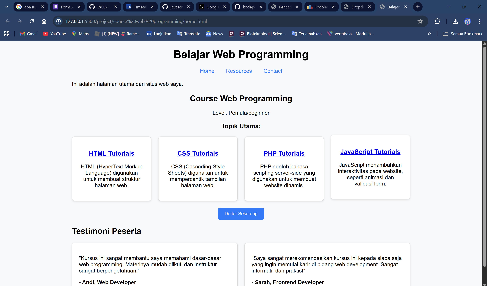

# Dokumentasi Project Course Web Programming

Project ini adalah website pembelajaran web programming yang menyediakan tutorial untuk berbagai teknologi web seperti HTML, CSS, dan JavaScript.

## File Utama

### 1. Home Page ([home.html](project/course%20web%20programming/home.html))

**Deskripsi:** Halaman utama website yang menampilkan overview course dan navigasi ke tutorial lainnya.

**Fitur:**
- Header dengan navigasi menu
- Grid layout untuk menampilkan card course
- Section testimoni dari peserta
- Responsive design dengan CSS Grid

**Komponen:**
- Navigation bar dengan link ke Home, Resources, dan Contact
- Card container dengan 4 course utama (HTML, CSS, PHP, JavaScript)
- Testimoni section dengan feedback dari alumni
- Call-to-action button "Daftar Sekarang"

### 2. HTML Tutorial ([coursehtml.html](project/course%20web%20programming/coursehtml.html))

**Deskripsi:** Halaman tutorial dasar-dasar HTML.

**Konten:**
- Pengenalan HTML (HyperText Markup Language)
- Dasar-dasar HTML:
  - Elemen HTML
  - Tag HTML  
  - Atribut HTML
- Link eksternal ke W3Schools untuk pembelajaran lanjutan

### 3. CSS Tutorial ([coursecss.html](project/course%20web%20programming/coursecss.html))

**Deskripsi:** Halaman tutorial dasar-dasar CSS.

**Konten:**
- Pengenalan CSS (Cascading Style Sheets)
- Dasar-dasar CSS:
  - Selektor CSS
  - Properti CSS
  - Nilai CSS
- Link eksternal ke W3Schools untuk pembelajaran lanjutan

### 4. JavaScript Tutorial ([coursejs.html](project/course%20web%20programming/coursejs.html))

**Deskripsi:** Halaman tutorial dasar-dasar JavaScript.

**Konten:**
- Pengenalan JavaScript untuk interaktivitas web
- Dasar-dasar JavaScript:
  - Variabel
  - Tipe Data
  - Fungsi
- Link eksternal ke W3Schools untuk pembelajaran lanjutan

### 5. Stylesheet ([style.css](project/course%20web%20programming/style.css))

**Deskripsi:** File CSS untuk styling seluruh website.

**Fitur Styling:**
- Typography menggunakan Arial, sans-serif
- Background warna #f8f9fa untuk kontras yang baik
- Responsive grid layout untuk card container
- Hover effects pada card dan button
- Modern design dengan border-radius dan box-shadow
- Button styling dengan color branding (#007bff)

## Teknologi yang Digunakan

- **HTML5:** Struktur dan konten halaman web
- **CSS3:** Styling dan layout dengan Grid system
- **Responsive Design:** Layout yang adaptif untuk berbagai ukuran layar

## Fitur Utama

1. **Multi-page Navigation:** Navigasi antar halaman tutorial
2. **Responsive Layout:** Grid system yang adaptif
3. **Interactive Elements:** Hover effects dan button interactions  
4. **External Resources:** Link ke sumber pembelajaran tambahan
5. **Modern UI/UX:** Clean design dengan card-based layout

Website ini dirancang sebagai platform pembelajaran yang mudah diakses dan user-friendly untuk memulai journey dalam web programming.